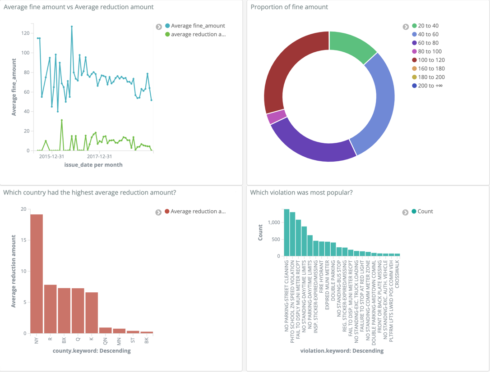

# This is for STA9760_bigdata Project 1 only Part 3 

Start:
export APP_KEY={MY_TOKEN}

docker-compose up -d

This will start ElasticSearch and Kibana.

ElasticSearch: http://localhost:9200 Kibana: http://localhost:5601

Running python:

docker-compose run pyth python parking.py --page_size=10000 --num_pages=400

export curl output:

curl -X GET {localhost:9200/parking-violation-index} > output.txt

Shutting off:

docker-compose down

